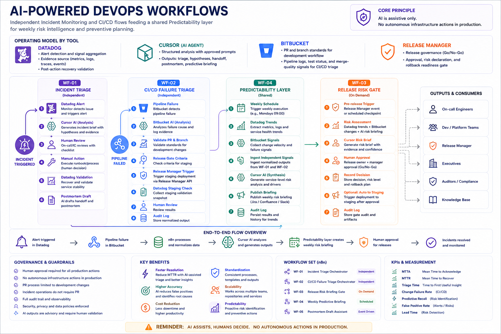

# AI DevOps Docs Hub

This directory is organized to keep bilingual (EN/PT) documentation easy to navigate and expand.

## Current structure
- `release_change_intelligence/` - **Point 1**: release task + PR change intelligence, risk anticipation, observability handoff (PT/EN plans and future artefacts)
- `docs/guides/` - implementation guides and onboarding docs
- `docs/workflows/` - workflow blueprints and orchestration docs
- `docs/executive/` - executive summaries and leadership-facing docs
- `data/jira/` - CSV files for Jira import and process tracks
- `deck/` - leadership slide outlines and speaker notes
- `operating-kit/` - SOP and operational one-pagers
- `policies/` - governance and security policy documents
- `runbooks/` - incident and CI/CD runbooks
- `metrics/` - KPI framework and dashboard specs
- `templates/` - approved prompt template library (EN/PT)
- `diagrams/` - architecture and flow diagrams

## Language convention
Use language subfolders when content is bilingual:
- `en/` for English
- `pt/` for Portuguese

## File naming convention
- Prefix sequence when useful: `01_`, `02_`, `03_`
- Use uppercase snake case for formal docs
- Keep filenames ASCII-only

## Key files
- `release_change_intelligence/pt/01_PLANO_IMPLANTACAO_INTELIGENCIA_MUDANCA_RELEASE.md` (DevOps AI rollout **point 1**)
- `docs/guides/GUIA_UNICO_IMPLANTACAO_IA_DEVOPS.md`
- `docs/guides/PASSO_A_PASSO_IMPLANTACAO_IA_DEVOPS_PTBR.md`
- `docs/guides/UNIFIED_AI_DEVOPS_IMPLEMENTATION_GUIDE_CONFLUENCE.md`
- `docs/workflows/N8N_WORKFLOW_BLUEPRINT.md`
- `docs/executive/RESUMO_EXECUTIVO_POC_JIRA_PTBR.md`
- `data/jira/jira_poc_bulk_import.csv`
- `data/jira/jira_process_improvement_tracks.csv`
- `data/jira/jira_release_change_intelligence_poc.csv` (Epic + Kanban-ready issues for Release Change Intelligence POC)
- `release_change_intelligence/docs/en/CONFLUENCE_RELEASE_CHANGE_INTELLIGENCE_POC.md` (Confluence-ready EN page)

## Template library
Use `templates/pt/` and `templates/en/` for approved prompt templates:
- Incident triage
- Hypothesis generation with confidence
- Incident handoff
- Postmortem draft
- CI/CD pipeline failure analysis
- Docker image and ECR troubleshooting
- Weekly risk briefing

## Architecture diagram (EN)

