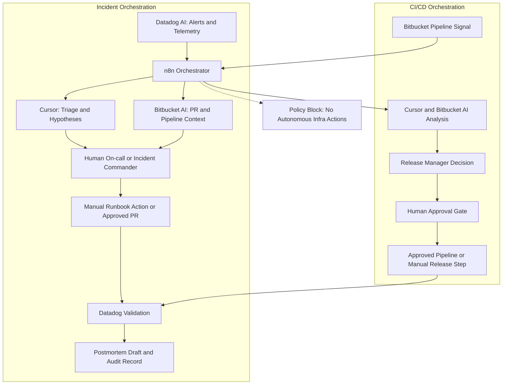

# Unified AI DevOps Implementation Guide
_Confluence-ready version (Incidents + CI/CD)_

## 1. Purpose
This document provides an end-to-end implementation guide for introducing AI into DevOps from zero maturity, with focus on:
- Incident response acceleration
- CI/CD risk reduction
- Predictive operational awareness
- Governance and security by design

**Core principle:** AI is assistive only.  
**Non-negotiable:** No autonomous infrastructure execution in production.

---

## 2. Scope
### In Scope
- Incident context summarization
- Evidence-based hypothesis generation
- Handoff and postmortem drafting
- CI pipeline failure triage support
- Pre-release risk briefing
- Weekly predictive risk briefing

### Out of Scope
- Autonomous remediation
- AI-triggered deploy/restart/scale/apply/delete
- Direct IaC/policy changes without human approval
- Prompts containing secrets or PII

---

## 3. Operating Model by Tool
### Datadog
- Alert detection and signal aggregation
- Evidence source (metrics, logs, traces, events)
- Post-action recovery validation

### Cursor (AI Agent)
- Structured incident and CI/CD analysis with approved prompts
- Outputs: triage summary, hypotheses, handoff, postmortem, predictive briefing

### Bitbucket
- PR and branch standards for development workflow
- Pipeline logs, test status, and merge-quality signals for CI/CD triage
- PR governance remains limited to development changes (not incident runbook execution)

### Release Manager
- Release governance (Go/No-Go)
- Approval, risk declaration, and rollback readiness gate

---

## 3.1 Independent Flows with Shared Predictability Layer
Incident Monitoring and CI/CD are independent operational flows.
Both feed a shared Predictability layer for weekly risk intelligence and preventive planning.

### Primary Use Cases
- Incident triage and recovery validation (Datadog AI + Cursor)
- CI/CD standards and failure triage (Bitbucket AI only on pipeline failure)
- Shared predictability insights from telemetry + delivery signals

### End-to-End Combined Flow
1. Incident Flow (independent):
   - Datadog AI summarizes incident signals
   - error trends, latency, saturation, impacted services, and timing
2. Cursor generates incident decision brief
   - current situation, top hypotheses, evidence links, manual next checks
3. On-call/IC applies human review checklist
4. Team executes manual action (runbook/process)
5. Datadog validates recovery and stability
6. CI/CD Flow (independent):
   - Bitbucket AI is triggered only on pipeline failure for CI triage
   - Branch and PR standards are validated for development changes
   - Release Manager triggers automatic deployment to staging after gate checks
7. Predictability Layer:
   - n8n aggregates incident + CI/CD signals into weekly risk briefing

### Why This Works
- Datadog AI answers "what is happening now"
- Cursor structures triage decisions for human execution
- Bitbucket AI focuses only on pipeline-failure diagnosis
- Predictability combines both streams without coupling runtime and delivery workflows

### Combined Guardrails
- No autonomous infra action from either AI
- Incident recommendations must include telemetry evidence
- PR process is limited to development changes only
- Incident operations do not require PR to execute manual runbook actions
- High-impact decisions require IC approval
- Predictability outputs are advisory and do not trigger automatic production actions

### Prompt Examples for Combined Usage
#### Prompt to Datadog AI (signal summary)
```text
Summarize this incident for service X in the last 60 minutes:
top anomalies, likely impact, strongest signals, and unresolved unknowns.
Return concise bullets with evidence references.
```

#### Prompt to Bitbucket AI (CI/CD only, pipeline failure)
```text
Analyze this failed pipeline for repository X.
Return probable root cause, supporting log evidence, and manual next checks.
Do not suggest or execute autonomous production actions.
```

#### Prompt to Cursor (incident decision brief)
```text
Using the Datadog AI summary,
produce an incident decision brief with:
1) current status, 2) top 3 hypotheses with confidence,
3) telemetry evidence map, 4) next manual validation checks,
5) recommended manual actions and risks.
Do not suggest autonomous infrastructure actions.
```

---

## 4. Preconditions (Before Pilot Starts)
1. Publish and approve AI usage policy
2. Publish mandatory human review checklist
3. Assign POC owner (DevOps Lead) and executive sponsor
4. Select pilot services and recurring scenarios
5. Capture baseline KPIs (pre-AI)
6. Define environment strategy: development -> staging -> production
7. Prepare a controlled development cluster with pilot apps (including apps already monitored in Datadog)

---

## 5. Required Configuration
## 5.1 Datadog - Minimum Setup
- Configure monitors for:
  - Error rate (5xx)
  - Latency (p95/p99)
  - Saturation (CPU/memory/connection pools)
  - Backlog/retry patterns
- Standardize incident evidence package:
  - Time window
  - Core charts
  - Deploy/config events
  - Sanitized logs
- Build POC dashboard with:
  - MTTA, MTTR, triage time
  - Predictive KPIs (recall, false-positive rate, lead time)

## 5.2 Cursor - Minimum Setup
- Store approved prompt templates in documentation repository
- Enforce standard output sections:
  - Situation
  - Impact
  - Evidence
  - Unknowns/data gaps
  - Next manual checks
- Enforce usage rules:
  - No secrets/PII
  - No autonomous-action instructions
  - Confidence level required

## 5.3 Bitbucket - Minimum Setup
- Enable branch protection
- Define branch naming standards (for development teams)
- Enforce PR template standards for development changes
- Capture pipeline failure evidence and expose to CI/CD triage flow
- Keep PR governance out of incident manual-response operations

## 5.4 Release Manager - Minimum Setup
- Mandatory release gate with:
  - Human approvals
  - Declared risk level
  - Validated rollback plan
  - Datadog monitoring plan
- Automatic trigger to staging when CI/CD gate conditions are met
- Record Go/No-Go decision with rationale

---

## 6. How to Communicate with the AI Agent (Cursor)
## Prompt Rules
- Always include operational context:
  - Service, environment, alert type, timeframe, symptoms, available evidence
- Always ask for structured output
- Always require evidence and explicit data gaps

## Prompt Example - Incident Triage
```text
You are assisting DevOps incident triage. Summarize this incident in bullets with:
(1) current situation, (2) impact, (3) key evidence, (4) top 3 hypotheses with confidence,
(5) next manual validation checks.
Do not suggest autonomous infrastructure actions.
If evidence is insufficient, explicitly say "insufficient evidence".
```

## Prompt Example - CI Failure Analysis
```text
Analyze this CI pipeline failure and return:
probable cause, evidence from logs, recommended manual checks, and test improvements to prevent recurrence.
Do not execute or suggest autonomous production actions.
```

## Prompt Example - Weekly Predictive Briefing
```text
Generate a weekly risk briefing for service X with:
risk level, key drivers, early warning patterns, preventive manual actions, confidence, and data gaps.
```

## Good Practices
- Keep prompts concise and objective
- One goal per prompt
- Specify expected output format
- Avoid broad questions without context

---

## 7. Standard Incident Workflow
1. Datadog alert triggers incident
2. On-call collects sanitized evidence
3. Cursor generates triage summary and hypotheses
4. On-call completes human review checklist
5. IC/on-call selects and executes manual runbook action
6. Datadog validates recovery
7. Cursor drafts handoff/postmortem
8. Team reviews and closes incident

**Rule:** No AI autonomous execution at any step.

---

## 8. Standard CI/CD Workflow
1. Pipeline failure or high release risk detected
2. Bitbucket AI analyzes pipeline logs and failure signals
3. DevOps validates CI/CD standards (branch/PR policy for dev changes)
4. Release Manager applies release gate and triggers staging automatically when approved
5. Staging validation is executed and monitored
6. Datadog monitors post-release behavior

---

## 9. 4-Week POC Execution Plan
## Week 1 - Foundation
- Publish policy and checklist
- Configure Cursor templates
- Capture baseline KPIs
- Confirm pilot services/scenarios
- Prepare controlled development cluster for end-to-end workflow testing

## Week 2 - Controlled Pilot
- Run AI-assisted incident triage in development environment
- Run CI mini-pilot on pipeline failures in development environment
- Record output usefulness per case
- Define promotion criteria to staging

## Week 3 - Calibration
- Promote to staging only after meeting development exit criteria
- Tune prompts, thresholds, and runbooks in staging
- Start weekly predictive briefing in staging
- Resolve data-quality gaps before any production rollout

## Week 4 - Evaluation and Decision
- Compare baseline vs POC outcomes
- Consolidate risks and gains
- Approve formal Go/No-Go for production rollout

## 9.1 Environment Promotion Gates
### Development -> Staging
- n8n workflows and prompts stable for at least one week
- Zero policy violations (security/data handling)
- Human review checklist completed in 100% of pilot cases

### Staging -> Production
- Demonstrated operational gain (triage time and/or MTTA improvement)
- Predictive false-positive rate within agreed threshold
- Joint approval from DevOps Lead, Release Manager, and Security

---

## 10. Simplified RACI
- DevOps Lead: program owner and governance
- Incident Commander: incident decision authority
- On-call Engineer: recommendation validation and manual execution
- Release Manager: release gating and risk control
- Security: policy/data compliance oversight

---

## 11. Required KPIs
## Efficiency
- MTTA
- MTTR
- Time to first validated hypothesis

## Quality
- AI suggestion usefulness rate
- Hypothesis precision
- Rework rate

## Control
- Human checklist compliance
- Policy violations (target: zero)

## Predictive
- Predictive recall
- False-positive rate
- Alert lead time

---

## 11.1 Acronyms and Meanings
- **POC**: Proof of Concept
- **KPI**: Key Performance Indicator
- **MTTA**: Mean Time To Acknowledge
- **MTTR**: Mean Time To Resolve
- **CI/CD**: Continuous Integration / Continuous Delivery
- **PR**: Pull Request
- **ECR**: Elastic Container Registry
- **SLO**: Service Level Objective
- **SLA**: Service Level Agreement
- **SLI**: Service Level Indicator
- **RCA**: Root Cause Analysis

---

## 12. POC Success Criteria
- At least 15% triage-time improvement
- Zero critical policy violations
- Team adoption of approved templates
- Measurable operational gain without risk increase

---

## 13. Common Risks and Mitigations
- Over-trust in AI output  
  -> Mandatory human review checklist
- Low output quality from poor prompts  
  -> Standardized prompt templates
- Sensitive data leakage  
  -> Mandatory sanitization and audit logging
- Excess predictive false positives  
  -> Biweekly threshold calibration

---

## 14. Quick Start Checklist (First 5 Days)
## Day 1
- Assign POC owner and sponsor
- Approve "no autonomous infra execution" rule

## Day 2
- Publish policy and checklist
- Confirm pilot services and scenarios

## Day 3
- Configure Datadog monitors and dashboard
- Publish Cursor prompt templates
- Confirm pilot apps in development cluster have minimum Datadog observability coverage

## Day 4
- Enable Bitbucket PR template
- Configure Release Manager gate
- Configure explicit promotion gates: development -> staging -> production

## Day 5
- Run simulation (game day) and adjust workflow

---

## 15. Minimum Deliverables
- AI usage policy (1 page)
- Human review checklist
- Approved prompt template library
- Two AI-assisted runbooks
- POC KPI dashboard
- Final POC report with Go/No-Go decision

---

## 16. n8n Orchestration Layer (Datadog AI + Bitbucket AI + Cursor)
n8n acts as the orchestration layer between Datadog AI, Bitbucket AI, Cursor, and Release Manager.

**Strict rule:** n8n must not execute autonomous infrastructure actions in production.



### n8n Responsibilities
- Ingest and normalize events from Datadog, Bitbucket, and Release Manager
- Enrich incident payloads with telemetry links, recent changes, owners, and service metadata
- Route structured context to AI analysis tools (Cursor and Bitbucket AI)
- Trigger notifications with evidence and manual next-check recommendations
- Create/update tickets, incident records, and audit entries
- Enforce approval gates before any production-impacting step

### Minimum n8n Implementation Steps
1. Create separate workflows for incident triage, CI failure triage, release risk briefing, and postmortem draft
2. Configure integrations with least privilege (prefer read-only by default)
3. Define a standard event schema (service, env, severity, owner, telemetry, change window, decision request)
4. Add explicit human approval nodes before production-impacting branches
5. Route only sanitized context to AI prompts (no secrets, no PII)
6. Send workflow decisions and approvals to an audit destination
7. Validate workflows in non-production with simulated incidents and pipeline failures

### n8n Security and Governance Controls
- Do not grant n8n direct production permissions for deploy/restart/scale/rollback/apply/delete
- Require explicit approver identity, timestamp, rationale, and evidence links on gated steps
- Store credentials in approved secret management, never in plain workflow fields
- Separate development/staging/production n8n projects and credentials
- Restrict workflow edits to authorized maintainers with review/approval
- Enable retry/timeouts/rate limits and failure alerts to prevent runaway automation

---

## 17. Process Improvement Tracks (from Practical DevOps AI Patterns)
These tracks are incremental and safe to run during the POC. They improve consistency without allowing autonomous infra actions.

### 17.1 Less Rework Track
- Standardize troubleshooting templates by domain:
  - Docker build/runtime issues
  - Kubernetes pod/service issues
  - Terraform plan and drift analysis (read-only)
  - CI/CD pipeline failure diagnosis
- Require every AI output to include:
  - evidence, confidence, data gaps, and next manual check
- Add KPI: percentage of cases resolved in first validated hypothesis cycle

### 17.2 More Standards Track
- Enforce one approved prompt template per scenario type
- Enforce response contract in incident and CI/CD briefs
- Add quality review every two weeks for prompt and output consistency
- Keep branch and PR standards limited to development workflow

### 17.3 Platform Troubleshooting Track
- Docker and ECR: use AI for pipeline image-build diagnostics, tag/version validation, and ECR push/pull troubleshooting
- Kubernetes: use AI for event/log correlation and health-check troubleshooting
- Terraform: use AI to explain `plan` output and identify drift risk
- Constraint: no apply/change execution by AI or automation layer

### 17.4 CI/CD Performance Track
- Use Bitbucket AI only for pipeline failure analysis and trend detection
- Add focused checks for image build stages (Docker build cache, dependency layers, ECR authentication, image publish steps)
- Use Release Manager to auto-trigger staging after gate approval
- Use Datadog to validate staging behavior before promotion decisions
- Add KPI: time-to-diagnose pipeline failures

### 17.5 Team Enablement Track (60 minutes)
- 20 min: policy and guardrails refresher
- 20 min: two real scenarios using approved templates
- 20 min: checklist validation and decision quality review

### 17.6 Additional POC KPIs
- Rework avoided rate
- First-cycle hypothesis resolution rate
- Template adherence rate
- CI failure diagnosis lead time

---

## Confluence Publishing Notes
- Paste this document into a Confluence page using the Markdown macro or standard editor.
- Convert each major section into collapsible sections if your team prefers compact pages.
- Add page labels such as: `ai-devops`, `incident-response`, `cicd`, `governance`, `poc`.
